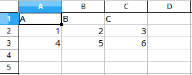

# Json Excel

Easily transform JSON data to Excel spreadsheets and vice versa. See it in action on [Heroku](https://json-excel.herokuapp.com/)

## Installation

Clone the repo:

    $ git clone https://github.com/RobinCheptileh/json-excel.git

Move into the directory:

    $ cd json-excel
    
Install dependencies:

    $ pip install -r requirements.txt

## Usage

Start the gunicorn server:

    $ gunicorn app:app

### 1. To Spreadsheet:

**Endpont**:

    /api/v1/to-spreadsheet
    
**Data**:

```json
{
	"header": ["A", "B", "C"],
	"rows": [
		[1, 2, 3],
		[4, 5, 6]
		]
}
```

**Request:**

    POST /api/v1/to-spreadsheet
    Content-Type: application/json
    Accept-Encoding: gzip, deflate
    Content-Length: 71
    Connection: keep-alive
    { "header": ["A", "B", "C"], "rows": [ [1, 2, 3], [4, 5, 6] ] }
    
**Spreadsheet Response:**



### 2. To JSON:

**Endpont**:

    /api/v1/to-json
    

_**More Coming Soon!**_

## Contributing

Bug reports and pull requests are welcome on GitHub at https://github.com/robincheptileh/json-excel. This project is intended to be a safe, welcoming space for collaboration, and contributors are expected to adhere to the [Contributor Covenant](http://contributor-covenant.org) code of conduct.

## License

The program is available as open source under the terms of the [MIT License](http://opensource.org/licenses/MIT).

## Code of Conduct

Everyone interacting in the Json Excel’s codebases, issue trackers, chat rooms and mailing lists is expected to follow the [code of conduct](https://github.com/robincheptileh/json-excel/blob/master/CODE_OF_CONDUCT.MD).